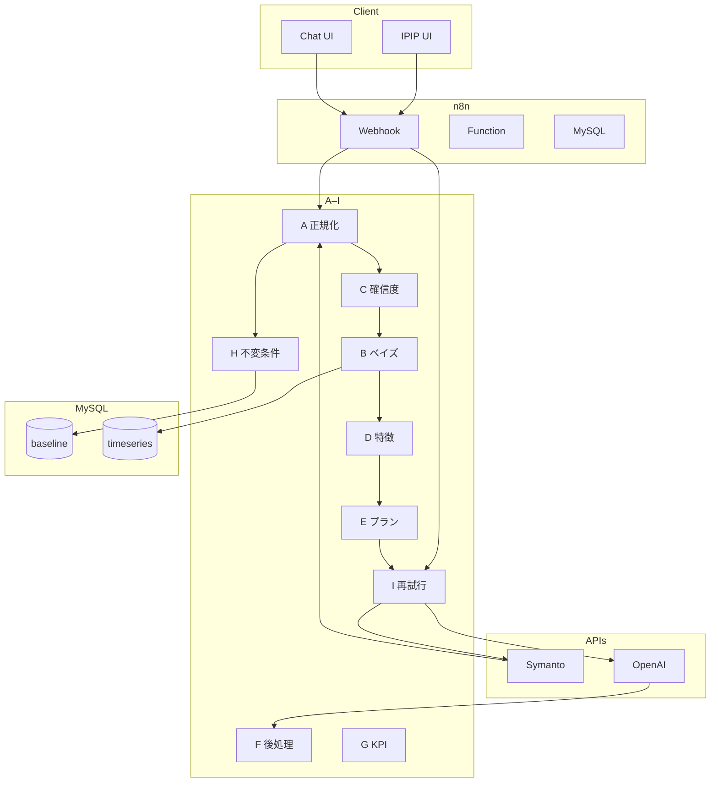
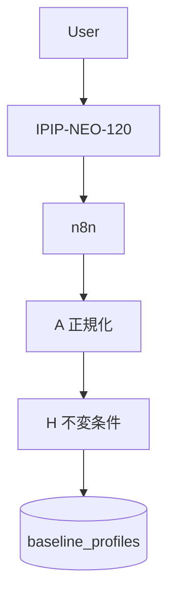
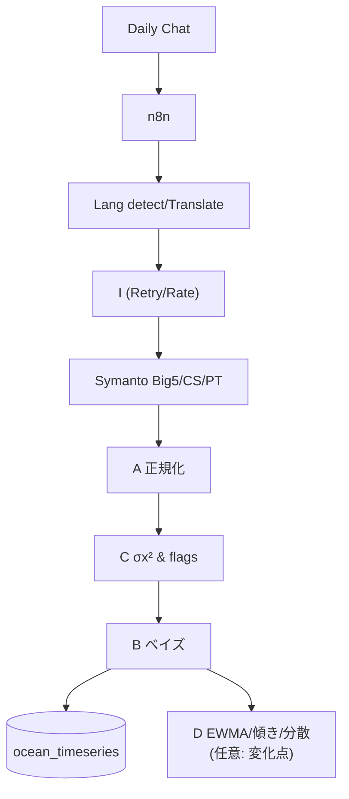
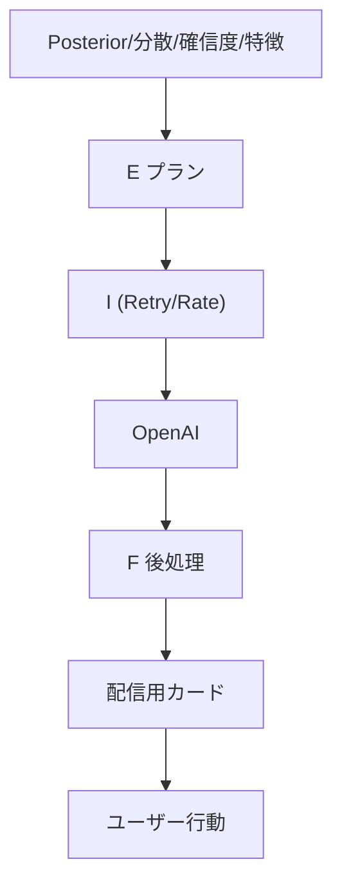
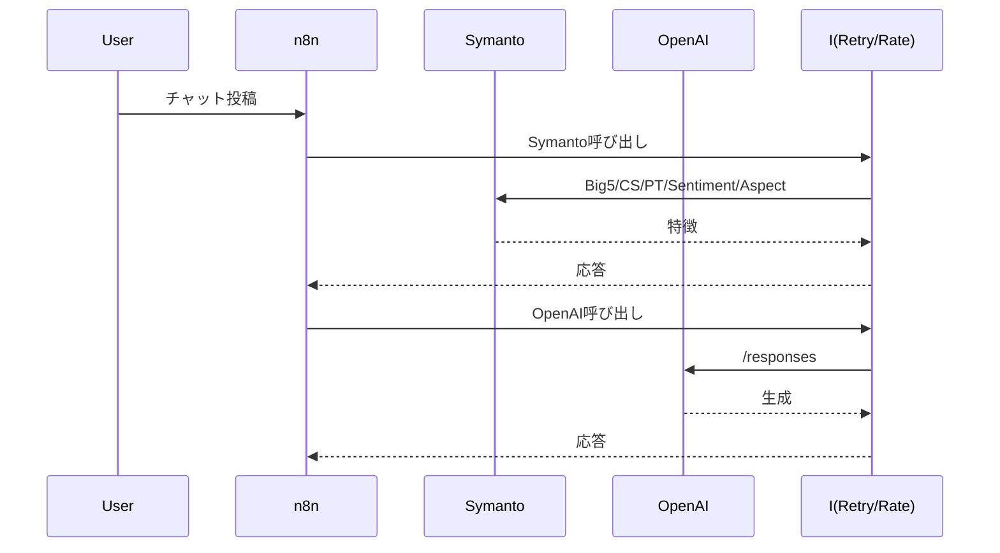

# requirements_AI_assistant — System & Specs

このリポジトリは、AIコーチシステムの合意仕様・設計・図面を集約したドキュメント集です。エンドツーエンドのユーザーフロー、アルゴリズム仕様（A〜I）、データモデル、不変条件、信頼性・安全性設計を網羅します。

## 概要
- **アーキテクチャ**: Mobile Web クライアント + n8n オーケストレーション + MySQL データ層。外部に Symanto 分析API群と OpenAI Responses API。
- **コアモジュール（A–I）**: 正規化(A)／ベイズ統合(B)／確信度・品質(C)／時系列特徴(D)／介入プランナー(E)／LLM後処理(F)／KPI(G)／データ不変条件(H)／信頼性制御(I)。
- **単位一貫性**: 人向けTスコア（0–100）と機械向け0–1（p01）の「二系統」を常に列で保持し、`norm_version` をメタに付与。

## エンドツーエンドの流れ
- **オンボーディング**: `IPIP-NEO-120` の採点→T/0–1へ正規化(A)→`baseline_profiles` に保存(H)→ベイズPrior(B)。
- **日次測定**: チャット→言語判定/翻訳→Symanto分析→正規化(A)→観測分散σx²と品質フラグ(C)→ベイズ統合(B)でPosteriorを `ocean_timeseries` へ→時系列特徴(D)。
- **介入配信**: 特徴群（Posterior/分散/確信度/トレンド/CS・PT/Sentiment/Aspect）からJITAIプランナー(E)→OpenAIで生成→後処理(F: Structured Outputs/Moderation/XSS/フォールバック/監査)→配信・行動ログ(G/H)。
- **信頼性**: 外部呼び出しは再試行/レート制限/サーキット/Retry-After尊重/Idempotency でIがラップ。

## コアモジュール（A–I）
- **A: 正規化**: IPIPのT/0–1化、Symanto出力の0–1/T整列、`norm_version` 付与、検証・欠損処理。
- **B: ベイズ統合**: Prior×Likelihoodを精度重み（1/分散）で統合。Posterior μ/σ² を T/0–1両系で `ocean_timeseries` に追記。分散に上下限。
- **C: 確信度/品質**: tokens/翻訳QE/OOD/言語ミスマッチから観測分散σx²（因子別）と品質フラグ。過小分散ガード・平滑・（任意）キャリブ。
- **D: 時系列特徴**: EWMA/直近傾き/ローリング分散＋（任意）変化点（CUSUM/PH/BOCPD）。ダッシュ/Eの強度制御に活用。任意 `ocean_features` テーブルに格納可。
- **E: 介入プランナー**: JITAI原則でCBT/WOOP/If–Thenとトーン/長さ/CTAを決定（低確信度・高分散時は強度クリップ）。
- **F: LLM後処理**: Structured Outputs(JSON Schema)で構造化、Moderation、XSS対策、長さ/表記の整形、段階フォールバック、完全監査。
- **G: KPI**: 実行率（Wilson CI）/Streak/Retention、効果量（Cohen’s d）、CUPED、EWMAトレンド、実験運用。
- **H: 不変条件**: 値域CHECK（T/p01）、追記専用（トリガ/権限）、一意性（`idempotency_key`）、ロール/権限、監査ログ、GDPR最小化。
- **I: 信頼性制御**: 408/429/5xx/timeoutのみ再試行、Retry-After尊重の指数バックオフ＋ジッター、サーキットブレーカ、Token Bucket、Idempotency-Key。

## データモデル（主要テーブル）
- `users`: ユーザー基本
- `baseline_profiles`: IPIP基準（O..N_T / O..N_p01, `norm_version`）
- `text_personality_estimates`: テキスト由来OCEANと観測分散（C）
- `ocean_timeseries`: Posterior（B）の追記専用（μ/σ², T/0–1）
- `ocean_features`（任意）: EWMA/傾き/分散/変化点（D）
- `intervention_plans`: Eの選定結果と根拠タグ（Fの監査と連携）
- `behavior_events`: 配信/閲覧/実行/完了（`idempotency_key` UNIQUE）
- `audit_log`: 入出力・判定・プロンプトの監査

## 外部サービス
- **Symanto**: Big Five / Communication Style / Personality Traits / Sentiment / Aspect（`docs/specification/symantoAPI/`）
- **OpenAI Responses API**: 介入カード生成（Structured Outputs/Moderation/XSSをFで実装）

## 図面・仕様
- **プレイブック**: `docs/system_flow_playbook_ja.md`（日本語）, `docs/system_flow_playbook.md`（英語）
- **Mermaid図**: `docs/diagrams/README.md`（分割図インデックス）
- **PDF仕様**: `docs/specification/`
  - `all_architecture_diagram_v2025-09-16.pdf`（全体）
  - `onboarding_baseline_flow_v2025-09-16.pdf`（オンボーディング）
  - `daily_measurement_pipeline_v2025-09-16.pdf`（日次測定）
  - `intervention_engagement_flow_v2025-09-16.pdf`（介入）
  - `specification_v3.0.pdf`（要件定義/機能設計）
- **モジュール詳細**: `docs/specification/algorism/`（A〜I 各ドキュメント）
- **Big5補助**: `docs/specification/Big5/IPIP-NEO-120におけるファセット`

## 図面クイックリンク（Mermaid, 00–09）
- 00: 全体アーキテクチャ — `docs/diagrams/00_overview_architecture.md`
- 01: オンボーディング（基準値）— `docs/diagrams/01_onboarding_baseline.md`
- 02: 日次測定パイプライン — `docs/diagrams/02_daily_measurement_pipeline.md`
- 03: 介入とエンゲージメント — `docs/diagrams/03_intervention_engagement.md`
- 04: 1日のシーケンス図 — `docs/diagrams/04_daily_sequence.md`
- 05: エラー制御・再試行 — `docs/diagrams/05_error_control_retries.md`
- 06: データ不変条件（H）— `docs/diagrams/06_data_model_invariants.md`
- 07: KPI集計・評価（G）— `docs/diagrams/07_kpi_analytics.md`
- 08: n8nフロー雛形 — `docs/diagrams/08_n8n_flows.md`
- 09: Symanto特徴の使い分け — `docs/diagrams/09_symanto_feature_usage.md`

## 図面サムネイル（抜粋）
概要と主要フローのサムネイルを以下に埋め込みます（詳細は各ファイル参照）。

### 00. 全体アーキテクチャ（サムネ）

### 01. オンボーディング（サムネ）

### 02. 日次測定パイプライン（サムネ）

### 03. 介入とエンゲージメント（サムネ）

### 04. 1日のシーケンス（サムネ）

## リポジトリの見方
- **まず読む**: プレイブック（JA/EN）→ 図面（Mermaid/PDF）→ A〜I各仕様→ データモデル(H)。
- **深掘り**: Symanto連携（HowToUse/overview）、F/Iの安全・信頼性要件、Gの実験・指標設計。

## 変更履歴
- 2025-09-16: 仕様書v3.0と詳細フロー図を追加
- 2025-09-XX: 二系統（T/p01）列の恒常保存に統一、`scale_type` 記述を整理、`ocean_features` DDL（任意）追補、Mermaid改行を ` ` に統一
