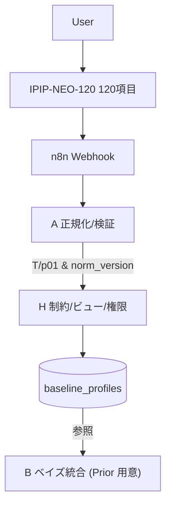

# 01. オンボーディング（基準値確立）

IPIP-NEO-120の採点→T/0–1へ正規化（A）。Hが値域/単位/追記専用の不変条件をDBで強制し、`baseline_profiles`に保存します。以降のベイズ統合（B）のPriorとして利用します。

```mermaid
flowchart TD
  U[User] --> F["IPIP-NEO-120 120項目"]
  F --> N[n8n Webhook]
  N --> A["A 正規化/検証"]
  A -->|"T/p01 & norm_version"| H["H 制約/ビュー/権限"]
  H --> T1[(baseline_profiles)]
  T1 -->|参照| B["B ベイズ統合 (Prior 用意)"]
```

