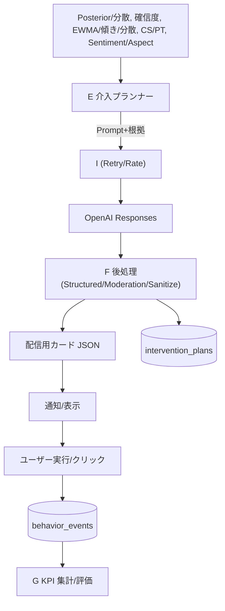

# 03. 介入とエンゲージメント

EがJITAI原則に従って介入（CBT/WOOP/If–Then）とトーン/長さ/CTAを決定。OpenAIで生成し、FがStructured Outputs・Moderation・サニタイズ・フォールバック・監査を担保。配信/行動は`behavior_events`に記録し、GがKPI集計します。

```mermaid
flowchart TD
  Inputs["Posterior/分散, 確信度, EWMA/傾き/分散, CS/PT, Sentiment/Aspect"] --> E[E 介入プランナー]
  E -->|"Prompt+根拠"| I2["I (Retry/Rate)"]
  I2 --> OAI[OpenAI Responses]
  OAI --> F["F 後処理(Structured/Moderation/Sanitize)"]
  F --> Card["配信用カード JSON"]
  Card --> Ntfy["通知/表示"]
  F --> T3[(intervention_plans)]
  Ntfy --> Act["ユーザー実行/クリック"]
  Act --> T4[(behavior_events)]
  T4 --> G["G KPI 集計/評価"]
```

