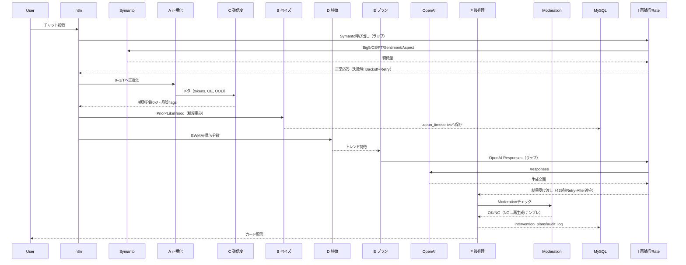

# 04. 1日のシーケンス図（E2E）

日次の処理シーケンスです。SymantoとOpenAIの外部呼び出しは常にI（再試行/レート制御）でラップし、429/5xx/timeoutを吸収します。Posteriorは`ocean_timeseries`へ追記、介入カードは後処理（F）経由で配信・監査保存します。

```mermaid
sequenceDiagram
  participant U as User
  participant N as n8n
  participant S as Symanto
  participant A as A 正規化
  participant C as C 確信度
  participant B as B ベイズ
  participant D as D 特徴
  participant E as E プラン
  participant O as OpenAI
  participant F as F 後処理
  participant M as Moderation
  participant DB as MySQL
  participant I as I 再試行/Rate

  U->>N: チャット投稿
  N->>I: Symanto呼び出し（ラップ）
  I->>S: Big5/CS/PT/Sentiment/Aspect
  S-->>I: 特徴量
  I-->>N: 正常応答（失敗時: Backoff+Retry）
  N->>A: 0–1/Tへ正規化
  A->>C: メタ（tokens, QE, OOD）
  C-->>N: 観測分散σx²・品質flags
  N->>B: Prior×Likelihood（精度重み）
  B-->>DB: ocean_timeseriesへ保存
  N->>D: EWMA/傾き/分散
  D-->>E: トレンド特徴
  E->>I: OpenAI Responses（ラップ）
  I->>O: /responses
  O-->>I: 生成文面
  I-->>F: 結果受け渡し（429時Retry-After遵守）
  F->>M: Moderationチェック
  M-->>F: OK/NG（NG→再生成/テンプレ）
  F-->>DB: intervention_plans/audit_log
  F-->>U: カード配信
```

