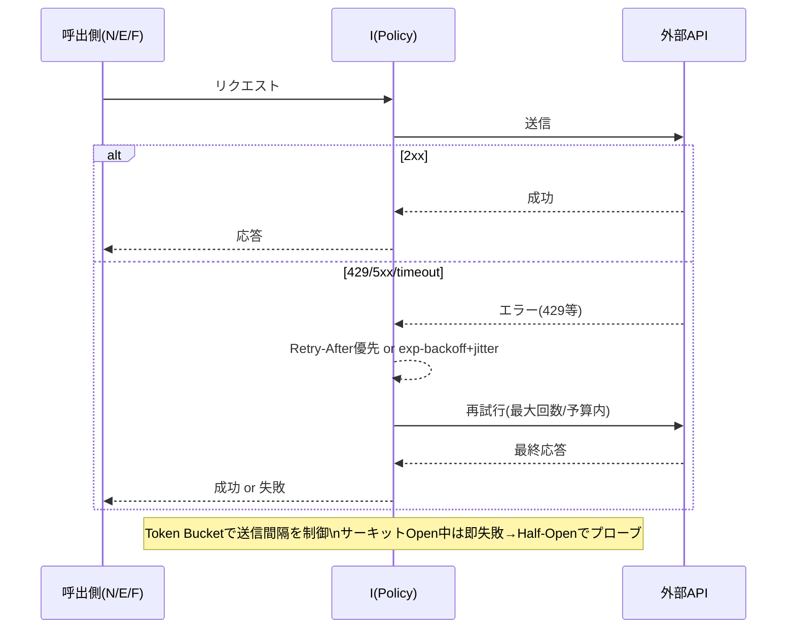

# 05. エラー制御・再試行・レート制限（I）

対象は408/429/5xx/timeout。`Retry-After`があれば遵守、なければ指数バックオフ＋ジッターで再試行。連続失敗でサーキットOpen→Half-Open→Close。クライアント側のToken Bucketで呼び出し速度を平滑化します。

```mermaid
sequenceDiagram
  participant Caller as 呼出側(N/E/F)
  participant I as I(Policy)
  participant API as 外部API
  Caller->>I: リクエスト
  I->>API: 送信
  alt 2xx
    API-->>I: 成功
    I-->>Caller: 応答
  else 429/5xx/timeout
    API-->>I: エラー(429等)
    I-->>I: Retry-After優先 or exp-backoff+jitter
    I->>API: 再試行(最大回数/予算内)
    API-->>I: 最終応答
    I-->>Caller: 成功 or 失敗
  end
  Note over I: Token Bucketで送信間隔を制御\nサーキットOpen中は即失敗→Half-Openでプローブ
```

