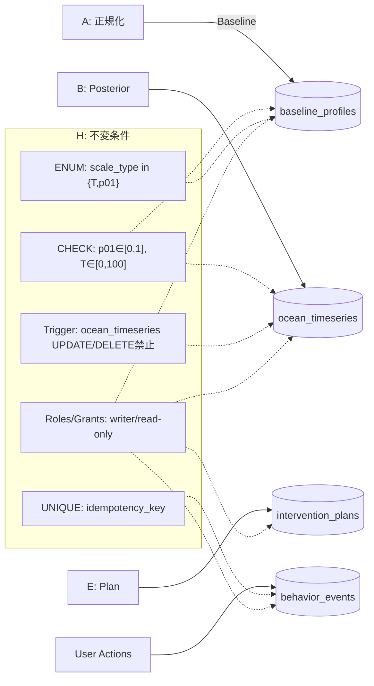

# 06. データモデルと不変条件（H）

DBレベルで値域/単位/CHECK/UNIQUE/権限/トリガを強制。`ocean_timeseries`は追記専用、`behavior_events.idempotency_key`はUNIQUE、`scale_type∈{T,p01}`とT/p01の範囲をCHECKします。

```mermaid
flowchart LR
  A1["A: 正規化"] -->|Baseline| BP[(baseline_profiles)]
  B1["B: Posterior"] --> OT[(ocean_timeseries)]
  E1["E: Plan"] --> IP[(intervention_plans)]
  UI[User Actions] --> BE[(behavior_events)]
  subgraph Constraints["H: 不変条件"]
    C1["CHECK: p01∈[0,1], T∈[0,100]"]
    C2["ENUM: scale_type in {T,p01}"]
    C3["Trigger: ocean_timeseries UPDATE/DELETE禁止"]
    C4["UNIQUE: idempotency_key"]
    C5["Roles/Grants: writer/read-only"]
  end
  C1 -.-> BP
  C2 -.-> BP
  C1 -.-> OT
  C3 -.-> OT
  C4 -.-> BE
  C5 -.-> BP
  C5 -.-> OT
  C5 -.-> IP
  C5 -.-> BE
```

