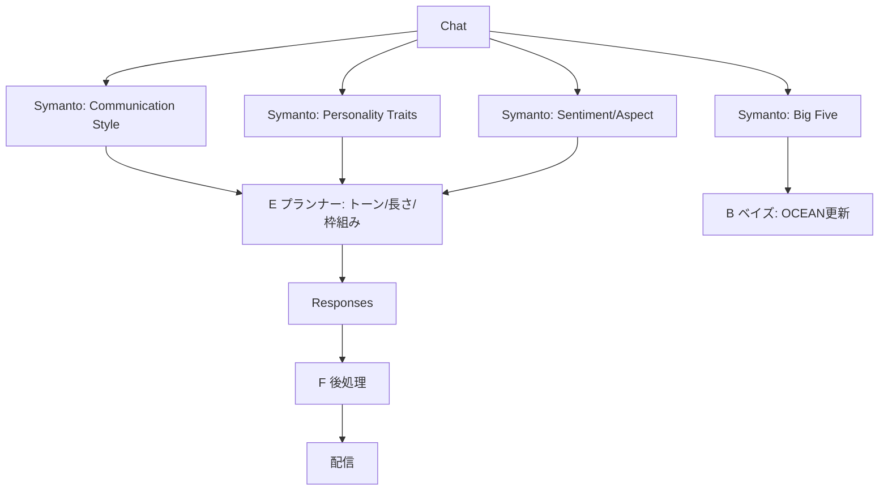

# 09. Symanto特徴の使い分け（介入向け）

Communication Style/Personality Traitsで「言い回し/枠組み」を合わせ、Big5でOCEANの“効き”を追跡。Sentiment/Aspectで“今日の感情/課題”にフィットさせ、Eの方策選択へ渡します。

```mermaid
flowchart TD
  Chat --> CS[Symanto: Communication Style]
  Chat --> PT[Symanto: Personality Traits]
  Chat --> SB[Symanto: Big Five]
  Chat --> SE[Symanto: Sentiment/Aspect]
  CS & PT --> E[E プランナー: トーン/長さ/枠組み]
  SB --> B[B ベイズ: OCEAN更新]
  SE --> E
  E --> OpenAI[Responses] --> F[F 後処理] --> 配信
```

