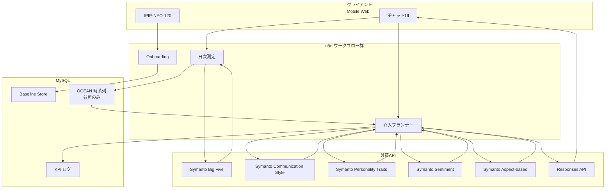

```mermaid
flowchart TD
  subgraph Client["クライアント<br/>Mobile Web"]
    UI["IPIP-NEO-120"]
    Chat["チャットUI"]
  end
  subgraph Orchestrator["n8n ワークフロー群"]
    Onb["Onboarding"]
    Measure["日次測定"]
    Plan["介入プランナー"]
  end
  subgraph APIs["外部API"]
    S_BF["Symanto Big Five"]
    S_CS["Symanto Communication Style"]
    S_PT["Symanto Personality Traits"]
    S_SEN["Symanto Sentiment"]
    S_ASP["Symanto Aspect-based"]
    LLM["Responses API"]
  end
  subgraph DB["MySQL"]
    Base["Baseline Store"]
    TS["OCEAN 時系列<br/>参照のみ"]
    KPI["KPI ログ"]
  end
  UI --> Onb --> Base
  Chat --> Measure --> S_BF --> Measure
  Measure --> TS
  Chat --> Plan
  Plan --> S_CS --> Plan
  Plan --> S_PT --> Plan
  Plan --> S_SEN --> Plan
  Plan --> S_ASP --> Plan
  TS --> Plan
  Plan --> LLM --> Chat
  Plan --> KPI
```
