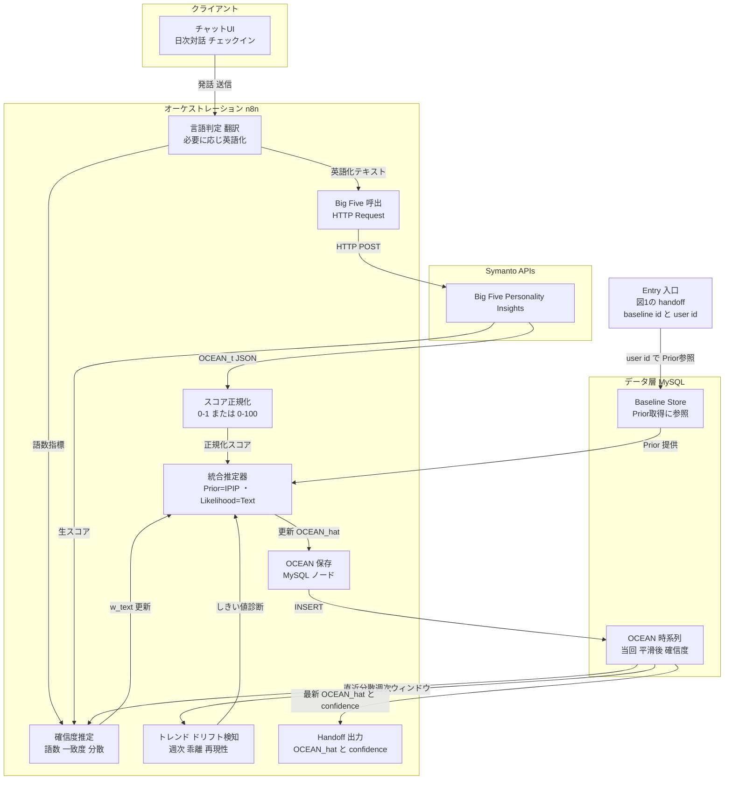

```mermaid
flowchart TD
  %% ========== ENTRY from Chart 1 ==========
  ENTRY_BASE["Entry 入口<br/>図1の handoff<br/>baseline id と user id"]

  %% ========== CLIENT ==========
  subgraph CLIENT["クライアント<br/>Mobile Web"]
    CHAT["チャットUI<br/>日次対話 チェックイン"]
  end

  %% ========== ORCHESTRATION ==========
  subgraph ORCH["オーケストレーション n8n"]
    LANG["言語判定 翻訳<br/>必要に応じ英語化"]
    BF_CALL["Big Five 呼出<br/>HTTP Request"]
    NORM["スコア正規化<br/>0-1 または 0-100"]
    FUSION["統合推定器<br/>Prior=IPIP ・ Likelihood=Text"]
    CONF["確信度推定<br/>語数 一致度 分散"]
    DRIFT["トレンド ドリフト検知<br/>週次 乖離 再現性"]
    SAVE_OCEAN["OCEAN 保存<br/>MySQL ノード"]
    OUT_OCEAN["Handoff 出力<br/>OCEAN_hat と confidence"]
  end

  %% ========== EXTERNAL API ==========
  subgraph APIS["Symanto APIs"]
    BF["Big Five Personality Insights"]
  end

  %% ========== DATA ==========
  subgraph DATA["データ層 MySQL"]
    BASE["Baseline Store<br/>Prior取得に参照"]
    OCEAN_TS["OCEAN 時系列<br/>当回 平滑後 確信度"]
  end

  %% ---------- Flow with explanations ----------
  ENTRY_BASE -- "user id で Prior参照" --> BASE
  CHAT -- "発話 送信" --> LANG
  LANG -- "英語化テキスト" --> BF_CALL
  BF_CALL -- "HTTP POST" --> BF
  BF -- "OCEAN_t JSON" --> NORM
  NORM -- "正規化スコア" --> FUSION
  BASE -- "Prior 提供" --> FUSION
  LANG -- "語数指標" --> CONF
  BF -- "生スコア" --> CONF
  OCEAN_TS -- "直近分散" --> CONF
  CONF -- "w_text 更新" --> FUSION
  FUSION -- "更新 OCEAN_hat" --> SAVE_OCEAN
  SAVE_OCEAN -- "INSERT" --> OCEAN_TS
  OCEAN_TS -- "週次ウィンドウ" --> DRIFT
  DRIFT -- "しきい値診断" --> FUSION
  OCEAN_TS -- "最新 OCEAN_hat と confidence" --> OUT_OCEAN
```
