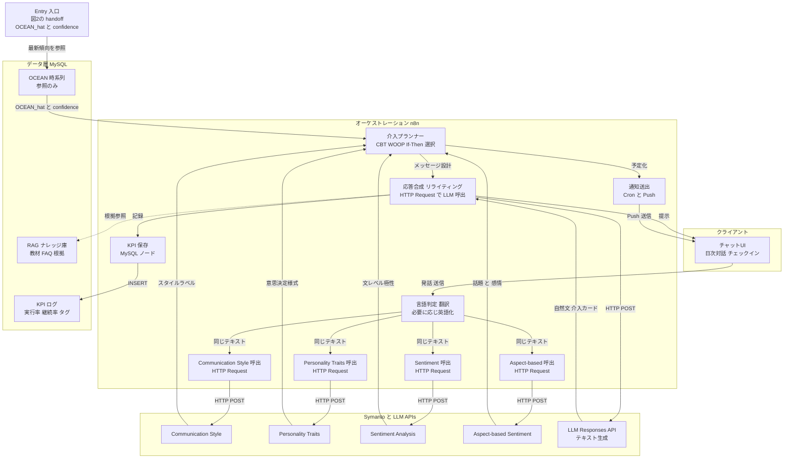

```mermaid
flowchart TD
  %% ========== ENTRY from Chart 2 ==========
  ENTRY_OCEAN["Entry 入口<br/>図2の handoff<br/>OCEAN_hat と confidence"]

  %% ========== CLIENT ==========
  subgraph CLIENT["クライアント<br/>Mobile Web"]
    CHAT["チャットUI<br/>日次対話 チェックイン"]
  end

  %% ========== ORCHESTRATION ==========
  subgraph ORCH["オーケストレーション n8n"]
    LANG["言語判定 翻訳<br/>必要に応じ英語化"]

    CS_CALL["Communication Style 呼出<br/>HTTP Request"]
    PT_CALL["Personality Traits 呼出<br/>HTTP Request"]
    SENT_CALL["Sentiment 呼出<br/>HTTP Request"]
    ASP_CALL["Aspect-based 呼出<br/>HTTP Request"]

    PLAN["介入プランナー<br/>CBT WOOP If-Then 選択"]
    RESP["応答合成 リライティング<br/>HTTP Request で LLM 呼出"]
    NOTIFY["通知送出<br/>Cron と Push"]
    SAVE_KPI["KPI 保存<br/>MySQL ノード"]
  end

  %% ========== EXTERNAL APIs ==========
  subgraph APIS["Symanto と LLM APIs"]
    CS["Communication Style"]
    PT["Personality Traits"]
    SENT["Sentiment Analysis"]
    ASP["Aspect-based Sentiment"]
    LLM["LLM Responses API<br/>テキスト生成"]
  end

  %% ========== DATA ==========
  subgraph DATA["データ層 MySQL"]
    OCEAN_TS["OCEAN 時系列<br/>参照のみ"]
    KPI["KPI ログ<br/>実行率 継続率 タグ"]
    KB["RAG ナレッジ庫<br/>教材 FAQ 根拠"]
  end

  %% ---------- Flow with explanations ----------
  ENTRY_OCEAN -- "最新傾向を参照" --> OCEAN_TS
  CHAT -- "発話 送信" --> LANG

  LANG -- "同じテキスト" --> CS_CALL
  CS_CALL -- "HTTP POST" --> CS
  CS -- "スタイルラベル" --> PLAN

  LANG -- "同じテキスト" --> PT_CALL
  PT_CALL -- "HTTP POST" --> PT
  PT -- "意思決定様式" --> PLAN

  LANG -- "同じテキスト" --> SENT_CALL
  SENT_CALL -- "HTTP POST" --> SENT
  SENT -- "文レベル極性" --> PLAN

  LANG -- "同じテキスト" --> ASP_CALL
  ASP_CALL -- "HTTP POST" --> ASP
  ASP -- "話題 と 感情" --> PLAN

  OCEAN_TS -- "OCEAN_hat と confidence" --> PLAN

  PLAN -- "メッセージ設計" --> RESP
  RESP -- "HTTP POST" --> LLM
  LLM -- "自然文 介入カード" --> RESP
  RESP -- "提示" --> CHAT
  RESP -. "根拠参照" .-> KB

  PLAN -- "予定化" --> NOTIFY
  NOTIFY -- "Push 送信" --> CHAT

  RESP -- "記録" --> SAVE_KPI
  SAVE_KPI -- "INSERT" --> KPI
```
