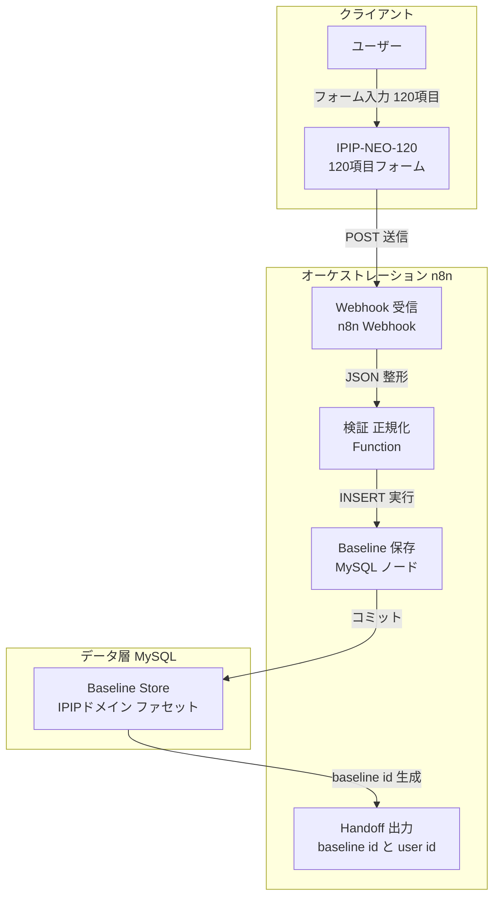

```mermaid
flowchart TD
  %% ========== CLIENT ==========
  subgraph CLIENT["クライアント<br/>Mobile Web"]
    U["ユーザー"]
    UI1["IPIP-NEO-120<br/>120項目フォーム"]
  end

  %% ========== ORCHESTRATION ==========
  subgraph ORCH["オーケストレーション n8n"]
    WB["Webhook 受信<br/>n8n Webhook"]
    VALID["検証 正規化<br/>Function"]
    SAVE_BASE["Baseline 保存<br/>MySQL ノード"]
    OUT_BASE["Handoff 出力<br/>baseline id と user id"]
  end

  %% ========== DATA ==========
  subgraph DATA["データ層 MySQL"]
    BASE["Baseline Store<br/>IPIPドメイン ファセット"]
  end

  %% ---------- Flow with explanations ----------
  U -- "フォーム入力 120項目" --> UI1
  UI1 -- "POST 送信" --> WB
  WB -- "JSON 整形" --> VALID
  VALID -- "INSERT 実行" --> SAVE_BASE
  SAVE_BASE -- "コミット" --> BASE
  BASE -- "baseline id 生成" --> OUT_BASE
```
